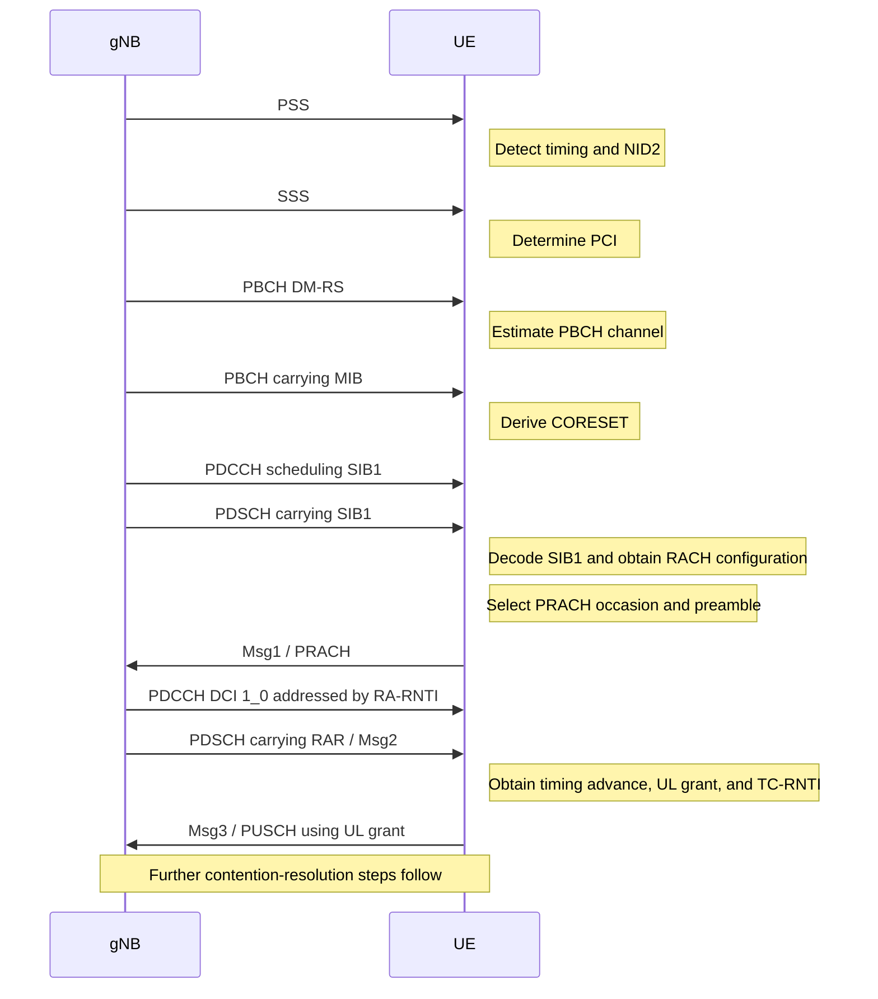
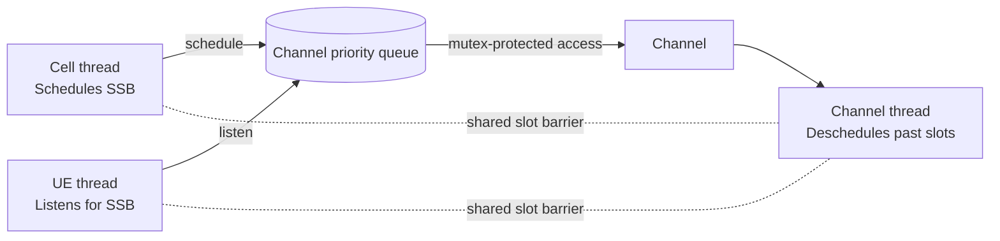

# UE RACH Simulator

A small C++20 simulation of UE and cell/channel activity across radio slots. The current implementation focuses on scheduling and detecting SSBs through a shared channel. The RACH procedure below describes the intended protocol flow as the simulator grows.

## Protocol overview



## Current simulator flow

The current executable models the initial SSB portion of the procedure. Three threads advance through the same slot barrier:



At each slot:

1. The UE checks the configured SSB frequency resource.
2. The cell schedules an SSB for a future slot.
3. The channel removes entries whose slot has passed.
4. The channel priority queue is protected by a mutex because scheduling, listening, and cleanup run across threads.

## Building and running

The project requires a C++20 compiler because it uses `std::barrier`.

```bash
g++ -std=c++20 -Wall -Wextra -Wpedantic -pthread \
    -Iinc main.cpp src/channel.cpp src/cell.cpp src/UE.cpp src/RadioTypes.cpp \
    -o rach_sim

./rach_sim
```

## Repository layout

| Path | Purpose |
| --- | --- |
| `main.cpp` | Starts the UE, cell, and channel threads and advances slots |
| `inc/channel.hpp`, `src/channel.cpp` | Shared channel and scheduled-message queue |
| `inc/cell.hpp`, `src/cell.cpp` | Cell-side SSB scheduling |
| `inc/UE.hpp`, `src/UE.cpp` | UE state and channel listening |
| `inc/RadioTypes.hpp` | Radio resources, payloads, message types, and queue ordering |

## Scope and next steps

The SSB scheduling/listening path is implemented. SIB1, PRACH Msg1, RAR/Msg2, Msg3, and contention resolution are represented in the protocol overview but are not yet implemented in the simulator.

## How SSB acquisition works

SSB is not an ordinary PDSCH transmission. A UE does not need an MCS, DCI, or an uplink grant to detect and decode it. PSS, SSS, PBCH, and PBCH-DMRS use a predefined 3GPP physical-layer format, allowing a UE with no prior cell-specific information to bootstrap itself into the network.

The acquisition hierarchy is:

```text
Supported NR bands, SCS possibilities, and synchronization raster
                              |
                              v
                    Search candidate SSB frequencies
                              |
                              v
             PSS correlation -> timing and NID2
                              |
                              v
             SSS correlation -> NID1 and PCI
                              |
                              v
       Known PBCH mapping + PBCH-DMRS -> channel estimate
                              |
                              v
              PBCH demodulation and Polar decoding
                              |
                              v
                         MIB acquired
                              |
                              v
              Locate initial PDCCH and decode SIB1
                              |
                              v
                    Obtain RACH configuration
```

### Fixed SSB resource structure

An SS/PBCH block occupies four OFDM symbols by 240 subcarriers. Its resource mapping is fixed; the UE does not need a control grant to discover where each component is located:

```text
                         Frequency
                             ^

Symbol 0       [             PSS             ]
Symbol 1       [       PBCH + PBCH-DMRS      ]
Symbol 2       [ PBCH ][      SSS      ][PBCH]
Symbol 3       [       PBCH + PBCH-DMRS      ]

                             -> Time
```

PSS and SSS occupy the central 127 subcarriers of their respective symbols. PBCH and PBCH-DMRS occupy the remaining predefined resource elements in the SS/PBCH block. Conceptually, the UE already knows: symbol 0 contains PSS, symbol 2 contains SSS, and symbols 1/2/3 contain PBCH and its DM-RS.

### Finding the SSB frequency

The UE does not scan every possible frequency in an NR band. It searches standardized synchronization-raster candidates, commonly represented through GSCN. In this simulator, `SSB_FREQ = 0` abstracts one candidate synchronization-raster location. That is a suitable simplification for the current slot/channel model; it does not mean a real network may place initial-access SSB arbitrarily.

### PSS, SSS, and PCI

PSS is a known synchronization sequence rather than encoded user data. The UE correlates the received samples with the three possible PSS sequences and selects the strongest peak:

```text
correlate with PSS_0 -> small
correlate with PSS_1 -> large peak -> NID2 = 1
correlate with PSS_2 -> small
```

The correlation peak provides timing and coarse frequency information. After PSS, the UE knows where the SSS must be located and correlates against the candidate SSS sequences to obtain `NID1`. The physical cell identity is then:

```text
PCI = 3 * NID1 + NID2
```

For example, `NID1 = 100` and `NID2 = 1` produce `PCI = 301`.

### PBCH and PBCH-DMRS

Once timing, SSB location, and PCI are known, the UE knows the PBCH and PBCH-DMRS resource elements from the standardized mapping. PBCH uses a predefined robust PHY format rather than a dynamically selected PDSCH MCS:

- QPSK modulation
- Polar channel coding
- fixed payload and resource mapping
- standardized PBCH-DMRS positions

The UE generates the expected PBCH-DMRS for the acquired PCI and compares it with the received DM-RS to estimate the channel. It can then equalize and decode PBCH:

```text
PBCH-DMRS channel estimation
            |
            v
       Equalization
            |
            v
     QPSK demodulation
            |
            v
       LLR generation
            |
            v
       Polar decoding
            |
            v
       PBCH CRC and MIB
```

This is different from PDSCH, where the UE needs scheduling information such as resource allocation and MCS from DCI. PBCH cannot depend on PDCCH because that would create a circular dependency: the UE needs PBCH/MIB to locate initial control information, so the initial broadcast channel must be independently discoverable.

### Recommended simulator abstraction

The current `Payload` and `ScheduledItem` types represent the result of successful PHY processing, not literal transmitted fields. A deeper PHY model could represent an SSB as:

```text
SsbTransmission
├── PSS sequence
├── SSS sequence
├── PBCH symbols
└── PBCH-DMRS
```

For the current protocol-level simulator, the DSP operations can remain abstracted while the UE state progression stays explicit:

```text
CELL_SEARCH
    -> PSS_DETECTED
    -> SSS_DETECTED
    -> PCI_ACQUIRED
    -> PBCH_DECODED
    -> MIB_ACQUIRED
    -> SIB1_DECODED
    -> RACH_READY
```

This preserves the correct initial-access mental model without requiring PSS/SSS correlation, channel estimation, or Polar decoding to be implemented before the RACH procedure itself is modeled.
